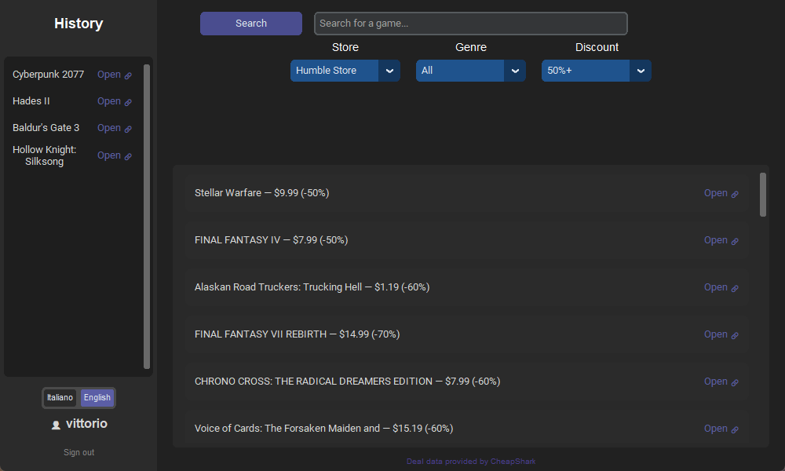

# Discount Searcher

🇮🇹 [Versione italiana](README.md) — the complete documentation is in Italian; this page covers what it does, how it is built, what happens to your data and how to run it from source.

**Video game deals from four stores, in a single window.** A free application for Windows:
no ads, no trackers, no data selling.

➡ **[Download the latest version](https://github.com/Occhiofly/DiscountSearcher/releases/latest/download/DiscountSearcher.zip)**
· Website: **[discountsearcher.it/en](https://discountsearcher.it/en/)**
· [Help centre](https://discountsearcher.it/en/support)

> **The code is readable, not reusable.** This project is **not open source**: the
> proprietary licence in [LICENSE](LICENSE) applies, all rights reserved. You may read and
> study the code; copying it, redistributing it or making your own version of it is not
> allowed. The application itself stays free for everyone.

## What it does

- Shows the most recent deals from **Steam, Epic Games Store, GOG and Humble Store** on one screen.
- Filters by **store, genre, minimum discount and title**, all at the same time.
- Opens a deal in the store **with one click**.
- Keeps the games you opened in a **history tied to your account**, so you find them again
  from another computer.
- Italian and English interface, chosen the first time you start the app.

## What it does not do

Worth knowing before you download:

- It is **not a catalogue search**: it shows the deals of the last 7 days, up to 50 per store.
- It does **not track prices over time** and sends **no notifications**.
- Prices are **in US dollars**, exactly as the CheapShark API provides them.
- **Windows only.** You can still create an account and use the help centre from any computer
  at [discountsearcher.it/en/register](https://discountsearcher.it/en/register).
- The executable is **not code-signed yet**, so Windows may show an "Unknown publisher"
  warning the first time: *More info* → *Run anyway*. We are working on it.

## How to install

1. Download `DiscountSearcher.zip` from the [latest release](https://github.com/Occhiofly/DiscountSearcher/releases/latest) (23 MB).
2. Extract the folder anywhere you like.
3. Run `DiscountSearcher.exe`. Python is not required.

Updating from an older version: replace the folder. Your account and history stay, because
they live on the server.

## How it is built

| Part | Technology |
|---|---|
| Desktop interface | CustomTkinter (Tkinter), dark theme |
| Deal data | Public [CheapShark](https://www.cheapshark.com/) API |
| Game genres | Public Steam API |
| Backend | FastAPI (Python), hosted separately from the app |
| Database | PostgreSQL on [Supabase](https://supabase.com/) |
| Password storage | PBKDF2-HMAC-SHA256, random per-user salt, 260,000 iterations |
| Sessions | Server-side session tokens verified on every request, revocable at any time |
| Website sign-in | Password plus a 6-digit code sent by email |
| Email | Sent by the server over SMTP; the desktop app never sends email |
| Packaging | Standalone Windows executable built with Nuitka |

The project is split in two halves that can run on different machines: the desktop app
(`main.py`, `backend.py`, `api_client.py`) and the server (`api/`). The website lives in
`web/` and is plain HTML, CSS and JavaScript, with no framework.

## Repository layout

| Folder | What is in it |
|---|---|
| `api/` | The FastAPI server: accounts, sessions, history, support tickets, staff area |
| `web/` | The website, Italian in the root and English in `web/en/` |
| `press/` | Screenshots and material for posts, in both languages |
| root | The desktop application and the build script |

The application zip is **not** in the repository: it is published with each
[release](https://github.com/Occhiofly/DiscountSearcher/releases).

## Accounts, email and security

Using the app requires an account: the history of the deals you opened is tied to it, so you
find it again from another computer. This is what happens to your data.

**Sign-up.** Username, password, a `@gmail.com` address and date of birth. The server creates
the account as **unverified** and emails a 6-digit code (generated with Python's `secrets`
module, meant for unpredictable values) that is valid for 15 minutes. An unverified account
**cannot sign in**: trying anyway sends a fresh code instead of failing with a generic error.
The same flow works from the website, for people who are not on Windows.

**Sign-in.** Wrong credentials always give the same message, "Wrong username or password",
without saying which one was wrong. On success the server opens a session and returns a
token, which the app stores locally in `session.json` and reuses on the next start.

**On the website, sign-in takes two steps**: after the password, the server emails a 6-digit
code valid for 10 minutes, and only that code opens the session. Five wrong codes and you
start again from the password. Sessions created this way are marked in a separate table, and
**support tickets and the staff area accept only those**: knowing a password and getting a
token the way the desktop app does is not enough to read tickets on the website.

**Passwords** are never stored: only a PBKDF2-HMAC-SHA256 hash, with a random per-user salt
and 260,000 iterations. Changing your username, email or password always requires typing the
**current** password again, and a security notice is emailed to the address the account had
**before** the change. Changing the password signs out every **other** device, not the one
making the change.

**Changing the email address takes two codes**, one to the **current** address and one to the
**new** one. The code to the current address stops someone who has learnt the password from
swapping in their own address and taking over the account; the code to the new address stops
you from locking yourself out with a typo. Codes last 15 minutes, five wrong attempts and it
starts over, and once done the old address is notified.

**Email is sent by the server only** (`api/`): the desktop application holds no credentials
and no sending logic. The server uses SMTP with a dedicated Gmail account and a Google "app
password", kept in `api/.env`, which is **not** in this repository.

| Type | When | What it contains |
|---|---|---|
| Verification code | On sign-up, or signing in with an unverified account | 6-digit code, valid 15 minutes |
| Security notice | When username, email or password change | What changed and when, sent to the previously registered address |
| Support ticket | When you open a ticket or reply, and when the team answers | The ticket and its replies, with a link to it |

**No newsletters and no advertising**, as the [privacy policy](https://discountsearcher.it/en/privacy)
says. The interactive API documentation (`/docs`) is off by default and stays off in
production, so the server does not list all of its endpoints to anyone passing by.

## Running it from source

Two halves, and the **server comes first**: the desktop app needs it running.

### 1. Server (`api/` folder)

Requirements: Python 3.10+ and a free [Supabase](https://supabase.com/) account.

1. Create a Supabase project and run, in its SQL Editor, `schema.sql` (repository root) and
   then `api/tickets_schema.sql`, `api/language_schema.sql`, `api/site_login_schema.sql` and
   `api/email_change_schema.sql`.
2. Copy the connection string from Supabase's "Connect" panel ("Session pooler" mode).
   If the password contains characters such as `@`, `/`, `?` or `#`, percent-encode them, or
   the address will not parse.
3. `pip install -r requirements.txt` from inside `api/`.
4. Copy `api/.env.example` to `api/.env` and fill in `DATABASE_URL`, `GMAIL_ADDRESS` and
   `GMAIL_APP_PASSWORD` (a Google "app password", not your normal one — a dedicated Gmail
   account is recommended). Optional: `CORS_ORIGINS`, `SITE_URL`, `SUPPORT_STAFF`,
   `STAFF_ACCOUNTS`, `ENABLE_API_DOCS=1` to turn the API docs on locally.
5. `uvicorn main:app --reload`, then open http://127.0.0.1:8000/health: it should answer
   `{"status":"ok","database":"connected"}`.

### 2. Desktop app

Requirements: Python 3.10+.

1. `pip install -r requirements.txt` from the repository root.
2. Check `api_config.py`: `API_BASE_URL` must point at your server (by default
   `http://127.0.0.1:8000`).
3. `python main.py`.

To build the standalone `.exe`, run `python build_app.py` (Nuitka; see the Italian
documentation for the details and for what to check before publishing a build).

## Team procedures

How the project is run day to day — support tickets and the staff area, publishing a new
version, maintenance mode — is written up separately, in English as well:
**[DOCUMENTAZIONE-TEAM.en.md](DOCUMENTAZIONE-TEAM.en.md)**
([italiano](DOCUMENTAZIONE-TEAM.md)).

## What the Italian documentation covers

The [Italian README](README.md) is the documentation the team works from. If you read Italian,
or do not mind a machine translation, it also explains:

- [why the project was created and how it was built](README.md#perch%C3%A9-%C3%A8-stato-creato)
- [how the window scales and resizes](README.md#la-finestra-dellapp)
- [how Italian and English are handled](README.md#italiano-e-inglese)
- [the anti-abuse limits](README.md#limiti-anti-abuso)
- [the project layout, file by file](README.md#struttura-del-progetto)
- [how the executable is built](README.md#creare-leseguibile-exe)

## Credits

Deal data from the public [CheapShark](https://www.cheapshark.com/) API, game genres from
Steam's public API. Discount Searcher is an independent project: it is not affiliated with,
sponsored by or approved by Valve / Steam, Epic Games, GOG, Humble Bundle or CheapShark. All
store names and trademarks belong to their respective owners.
