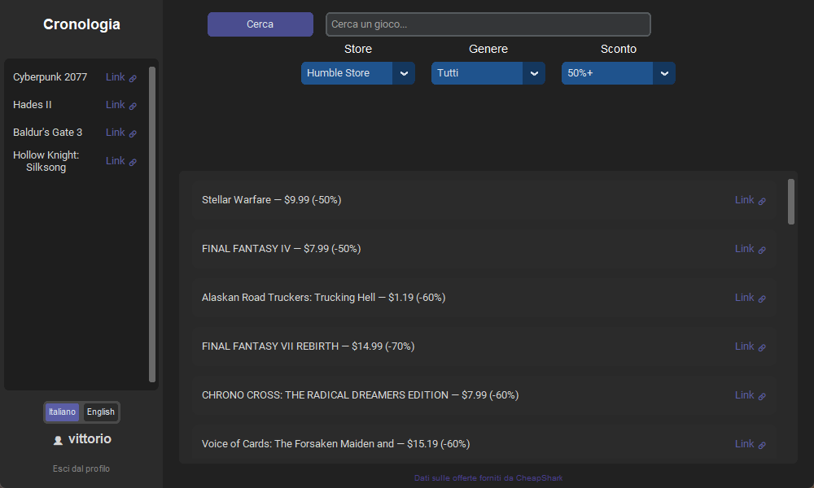

# Discount Searcher

🇬🇧 [English version](README.en.md) — a shorter page for who arrives from outside.

**Le offerte sui videogiochi di quattro negozi, in un'unica finestra.** Applicazione gratuita
per Windows: niente pubblicità, niente tracciamenti, niente dati venduti.

➡ **[Scarica l'ultima versione](https://github.com/Occhiofly/DiscountSearcher/releases/latest/download/DiscountSearcher.zip)** · Sito: **[discountsearcher.it](https://discountsearcher.it)**
· [Centro assistenza](https://discountsearcher.it/assistenza)



Questa pagina racconta **come è fatto il progetto e perché**: le scelte tecniche, come
funzionano account, sicurezza ed email, come si compila l'eseguibile e come è organizzato il
sito. È la documentazione che usiamo noi, lasciata pubblica perché chi scarica l'app possa
vedere cosa c'è dentro.

> **Il codice è visibile, non riusabile.** Il progetto **non è open source**: vale la licenza
> proprietaria nel file [LICENSE](LICENSE), tutti i diritti riservati. Si può leggere e
> studiare; copiarlo, ridistribuirlo o farne versioni proprie no. L'applicazione, invece, è
> gratuita per tutti.

---

Discount Searcher è un'applicazione desktop per Windows, scritta in Python, che cerca in tempo reale le migliori offerte di videogiochi su più negozi digitali (Steam, Epic Games, GOG, Humble Store), permettendo di filtrare i risultati per negozio, genere del gioco, percentuale minima di sconto e nome del titolo.

## Perché è stato creato

L'app nasce come progetto personale e di apprendimento, con l'obiettivo di riunire in un'unica interfaccia dei filtri di ricerca — in particolare il filtro per genere, non sempre disponibile sui siti di aggregazione sconti — che normalmente andrebbero cercati separatamente su più negozi o siti diversi. L'idea è semplice: aprire l'app, impostare i propri criteri (es. "solo giochi RPG scontati almeno del 50% su Steam") e ottenere subito una lista pulita di risultati, senza dover controllare a mano ogni singolo store.

## Come è stato sviluppato

| Componente | Tecnologia usata |
|---|---|
| Interfaccia grafica | CustomTkinter (basato su Tkinter), tema scuro |
| Dati sulle offerte | API pubblica di [CheapShark](https://www.cheapshark.com/) |
| Generi dei videogiochi | API pubblica di Steam |
| Backend / API | FastAPI (Python), ospitato separatamente dall'app desktop |
| Database | PostgreSQL, ospitato su [Supabase](https://supabase.com/) |
| Sicurezza password | PBKDF2-HMAC-SHA256 con salt casuale per utente (260.000 iterazioni), confronto a tempo costante per evitare timing attack |
| Sessioni | Token di sessione verificati lato server ad ogni richiesta (non JWT autofirmati), così un accesso può essere revocato immediatamente anche prima della sua scadenza naturale |
| Verifica email | Invio di un codice via SMTP (Gmail), gestito interamente dal server — l'app desktop non invia mai email direttamente |
| Distribuzione | Eseguibile standalone per Windows compilato con Nuitka — chi usa l'app non deve installare Python |

L'app desktop non contiene più nessun database né logica di autenticazione: comunica con il backend esclusivamente tramite richieste HTTP. Questo significa che lo stesso account (con la stessa cronologia) può essere usato da più dispositivi diversi, cosa impossibile nella prima versione del progetto, dove ogni installazione aveva il proprio database SQLite isolato.

Il progetto è organizzato in due parti separate: l'app desktop (`main.py`, `backend.py`, `api_client.py`) e il backend (cartella `api/`), che possono girare su due computer diversi.

# Registrazione e login

## Registrazione

Per creare un account servono: username, password, un indirizzo email che deve obbligatoriamente terminare in `@gmail.com` e che non sia già collegato a un altro account (il confronto ignora maiuscole e minuscole: il vincolo `users_email_unico` nel database è su `lower(email)`, perché per la posta `Mario@gmail.com` e `mario@gmail.com` sono la stessa casella), e la data di nascita (giorno, mese, anno — con controlli in tempo reale che impediscono di inserire valori impossibili, es. giorno oltre 31 o mese oltre 12).

Al momento della registrazione:
1. L'app desktop invia i dati al backend, che crea l'account nel database — ma segnato come **non verificato**
2. Il backend genera un codice numerico a 6 cifre (tramite il modulo `secrets`, pensato per generare valori non prevedibili) e lo invia all'indirizzo email inserito
3. L'utente viene reindirizzato a una schermata dedicata dove deve inserire il codice ricevuto, valido per 15 minuti
4. Se il codice è corretto e non scaduto, l'account viene attivato; è anche possibile richiedere l'invio di un nuovo codice se quello precedente è scaduto o non è mai arrivato

Un account non verificato **non può accedere**: se si prova comunque il login con credenziali corrette ma email non confermata, l'app richiede automaticamente un nuovo codice al backend e riporta l'utente alla schermata di verifica, invece di far fallire il login con un generico errore.

**Registrazione anche dal sito** (`web/registrati.html`, `web/en/register.html`, script `web/assets/js/pages/register.js`): stessi endpoint dell'app (`/register`, `/verify-email`, `/resend-code`) e stesse regole, con il passaggio del codice a 6 cifre nella stessa pagina. Serve a chi non usa Windows — l'applicazione è solo per Windows, ma il Centro assistenza, i ticket e l'area staff funzionano da qualsiasi computer, quindi chi fa assistenza da un Mac deve comunque potersi creare l'account.

## Login

Username e password vengono controllati dal backend; se sbagliati, l'app mostra un messaggio generico ("Username o password errati") senza specificare quale dei due sia sbagliato, per non facilitare tentativi di indovinare le credenziali. In caso di successo, il backend crea una sessione e restituisce un token, che l'app salva in locale (`session.json`): ai successivi avvii, l'app verifica che quel token sia ancora valido e riapre automaticamente sulla schermata principale, senza richiedere di rifare il login ogni volta.

**Sul sito l'accesso è in due passaggi** (`api/site_login.py`): dopo username e password il server manda un codice di 6 cifre all'email dell'account, valido 10 minuti, e solo con quel codice apre la sessione. Al quinto codice sbagliato si ricomincia dalla password, e i reinvii hanno gli stessi limiti degli altri codici. Le sessioni nate così sono segnate nella tabella `site_sessions`, e **ticket e area staff accettano solo quelle**: chi conosce una password e ottiene un token con `/login`, come fa l'app, non riesce comunque a leggere i ticket dal sito. L'app desktop continua ad accedere con la sola password, perché non usa i ticket.

Ogni login crea una sessione distinta associata a quel dispositivo: il backend tiene traccia di quali dispositivi sono collegati a un account e permette di revocare l'accesso di uno specifico dispositivo da remoto, senza dover cambiare la password. Questa gestione è già disponibile lato backend (consultabile tramite la documentazione interattiva dell'API, `/docs`, che però è spenta di base: si accende in locale con `ENABLE_API_DOCS=1`, e su Render va lasciata spenta perché elencherebbe a chiunque tutti gli indirizzi del server), ma **non è ancora integrata in una schermata dell'app desktop**: al momento l'app usa solo la creazione e la revoca della propria sessione (login/logout), non la visualizzazione degli altri dispositivi collegati.

## Modifica del profilo

Dalla sezione Profilo è possibile cambiare username, email (sempre obbligatoriamente `@gmail.com`) e password. Qualsiasi modifica richiede, come conferma, di reinserire la password **attuale** dell'account: verifica e aggiornamento avvengono in un'unica richiesta al backend. Ad ogni modifica confermata, il backend invia anche un'email di notifica di sicurezza (vedi sezione successiva) all'indirizzo email che l'account aveva **prima** della modifica. Se la password viene cambiata, il backend disconnette automaticamente tutti gli **altri** dispositivi collegati all'account (quello che sta effettuando la modifica resta connesso).

**L'email invece non cambia con la sola password** (`api/email_change.py`): il backend manda due codici, uno all'indirizzo **attuale** e uno a quello **nuovo**, e l'app li chiede in una schermata apposita. Il codice all'indirizzo attuale impedisce a chi ha scoperto la password di mettere la propria email e prendersi l'account (con i codici del sito e del recupero password); quello al nuovo indirizzo evita di perdere l'accesso per un errore di battitura. I codici valgono 15 minuti, al quinto errore si ricomincia, e a cambio fatto il vecchio indirizzo riceve l'avviso. Chi non ha più accesso alla vecchia email chiede al team con un ticket. Serve l'app 1.0.4 o successiva: le versioni precedenti non hanno la schermata dei codici.

# Email

L'invio delle email avviene **esclusivamente lato server** (cartella `api/`): l'app desktop non contiene più nessuna credenziale né logica di invio. Il backend usa il protocollo SMTP con un account Gmail dedicato e una "Password per le app" generata da Google (non la normale password dell'account — Google non permette l'accesso SMTP diretto con quella). Le credenziali sono definite in un file locale del backend, `api/.env`, che **non viene incluso nel repository** per non esporre pubblicamente le chiavi di accesso.

Il backend invia due tipi di email:

| Tipo | Quando | Contenuto |
|---|---|---|
| Codice di verifica | Alla registrazione, o al tentativo di login con account non ancora verificato | Codice a 6 cifre, valido 15 minuti |
| Notifica di sicurezza | Quando username, email o password vengono modificati dal Profilo | Cosa è stato modificato e quando, inviata alla vecchia email registrata |
| Ticket di assistenza | Quando un utente apre un ticket o risponde dal sito, e quando lo staff risponde | Allo staff: il ticket, con oggetto `[DS-1001]`. All'utente: conferma e avviso delle risposte, con il link al ticket |

## Limiti anti-abuso

Contro i tentativi a raffica e l'uso dell'invio email come arma, il server tiene
in memoria alcuni contatori (`api/rate_limit.py`):
- login e recupero password: dopo 5 tentativi sbagliati in 15 minuti sullo stesso username, blocco temporaneo; lo stesso per il codice di verifica dell'email;
- email con un codice (verifica, reinvio, recupero password): al massimo una al minuto e 3 ogni 15 minuti per lo stesso account o indirizzo, e 200 in tutto ogni 24 ore, così resta sempre spazio nel limite giornaliero di Gmail per le email dei ticket;
- ogni campo di testo ha una lunghezza massima, e le nuove password devono avere almeno 8 caratteri (chi ha già un account accede con quella che ha);
- una richiesta non può superare 15 MB, anche se inviata "a pezzi" (`api/body_limit.py`).

Gli errori di validazione arrivano come frase già pronta nella lingua di chi ha scritto
(es. "La password deve avere almeno 8 caratteri" oppure "The password must be at least 8
characters long"), che l'app e il sito mostrano così com'è.

## La finestra dell'app

La finestra parte a 1000x600 ma si può **ridimensionare e ingrandire a tutto schermo**: con
il pulsante in alto a destra del menu principale, con **F11**, o con i normali pulsanti della
barra del titolo di Windows. Si torna alla finestra piccola allo stesso modo. È una finestra
ingrandita, non uno "schermo intero" senza bordi: la barra del titolo resta sempre
disponibile. La scelta è salvata in `%APPDATA%\DiscountSearcher\settings.json`
(`"maximized"`), così l'app riparte come la si era lasciata.

I pannelli sono posizionati in percentuale (`relx`/`rely`), quindi si adattano da soli alla
dimensione della finestra; l'elenco dei risultati è ancorato sotto i filtri e cresce insieme
alla finestra. Sotto i 900x560 i campi si sovrapporrebbero, quindi quello è il minimo
consentito (`minsize`).

Non basta però spostare i pannelli: ingrandendo, **scritte e comandi crescono con la
finestra** (`_adatta_alla_finestra`), altrimenti resterebbero minuscoli in mezzo al vuoto. La
scala dei widget di CustomTkinter segue il lato più stretto rispetto ai 1000x600 di
partenza, fra 1.0 e 1.6; il calcolo aspetta 250 ms dopo l'ultimo ridimensionamento, per non
ridisegnare tutto a ogni pixel trascinato, e viene rifatto subito quando si preme
Ingrandisci o Riduci. Le righe dell'elenco restano in una colonna centrata di circa 1000
punti (`_MAX_LARGHEZZA_RIGA`): su uno schermo largo, senza quel limite, il titolo del gioco e
il suo "Link" finirebbero ai due lati opposti.

La finestra si ingrandisce e si riduce anche dai pulsanti della barra del titolo di
Windows, che l'app non riceve come comando: a ogni ridimensionamento l'app controlla quindi
com'è davvero la finestra (`_sincronizza_stato_finestra`) e allinea il pulsante, la scala e
la preferenza salvata. Senza quel controllo continuava a credersi ingrandita, con il
pulsante che diceva il contrario di quello che faceva e i comandi rimasti grandi in una
finestra piccola.

Due trappole di CustomTkinter, trovate con la revisione del codice: `padx` passato a
`pack()` viene moltiplicato per la scala **effettiva** (la nostra per l'ingrandimento di
Windows, `ScalingTracker.get_widget_scaling`), mentre `pack_configure()` non la applica
affatto — quindi i margini si calcolano in unità di widget e si riapplicano sempre con
`pack()`. Inoltre, cambiando scala, CustomTkinter blocca minimo e massimo della finestra per
un secondo: in quell'attimo il pulsante Ingrandisci/Riduci resta spento, altrimenti la
finestra non ubbidirebbe e il pulsante direbbe il falso.

## Italiano e inglese

App, sito, risposte del server ed email esistono nelle due lingue.

- **App desktop**: al primo avvio l'app **chiede la lingua** con una schermata dedicata
  (due pulsanti, Italiano e English; quello evidenziato è la lingua di Windows, come
  suggerimento, e l'Invio lo conferma). Dagli avvii successivi parte nella lingua scelta,
  che resta salvata in `%APPDATA%\DiscountSearcher\settings.json`; si cambia quando si
  vuole dal selettore "Italiano | English", in alto a destra nella schermata di accesso e
  sotto la cronologia nel menu principale. I testi sono in `strings.py`.
- **Sito**: italiano nella cartella principale, inglese in `/en/` (vedi `web/README.md`).
- **Server**: risponde nella lingua chiesta con l'intestazione `Accept-Language`
  (`api/i18n.py`). L'app e il sito la mandano sempre.
- **Email all'utente**: nella lingua dell'**account** (colonna `users.language`), non in
  quella della richiesta: un'email di risposta a un ticket può partire giorni dopo.
  La lingua dell'account si aggiorna a ogni accesso, seguendo quella dell'app o del sito
  da cui si entra.
- **Email allo staff**: restano in italiano.

La colonna `language` si aggiunge al database con `api/language_schema.sql`, **prima** di
pubblicare il server nuovo.

**Robustezza**: se l'invio di un'email fallisce (credenziali non configurate, problemi di rete, ecc.), l'operazione principale non viene comunque bloccata — un account viene creato anche se l'email non parte subito (l'utente può richiedere un nuovo invio), e una modifica al profilo viene salvata anche se la notifica di sicurezza non riesce a partire.

# Procedure del team

Ticket di assistenza e area staff, pubblicazione di una versione nuova e modalità
manutenzione stanno in **[DOCUMENTAZIONE-TEAM.md](DOCUMENTAZIONE-TEAM.md)**
([English version](DOCUMENTAZIONE-TEAM.en.md)): sono le
procedure di chi lavora al progetto, non servono a chi lo usa.

# In caso di bug

Se riscontri un bug o hai un problema con l'app, contatta lo staff tramite il nostro server Discord: **[link disponibile prossimamente]**

# Ringraziamenti

Un ringraziamento speciale a chiunque scelga di usare Discount Searcher. Ogni segnalazione di bug, suggerimento o feedback è preziosa per migliorare l'app.

---

## Installazione e avvio (dal codice sorgente)

Il progetto è in due parti: **prima il backend**, poi l'app desktop (che ha bisogno del backend già avviato per funzionare).

### 1. Backend (cartella `api/`)

Requisiti: Python 3.10+, un account [Supabase](https://supabase.com/) (gratuito)

1. Crea un progetto Supabase ed esegui `schema.sql` (nella cartella principale) nel suo SQL Editor: contiene **tutte** le tabelle, compresi ticket, accesso dal sito e cambio email. I file `api/*_schema.sql` sono le aggiunte fatte via via su un database che esisteva già: su un progetto nuovo non servono
2. Recupera la stringa di connessione al database dal pannello "Connect" di Supabase (modalità "Session pooler", consigliata per un server con connessioni persistenti)
3. Dalla cartella `api/`, installa le dipendenze:
   ```bash
   pip install -r requirements.txt
   ```
4. Crea un file `api/.env` (copiando `api/.env.example`) con:
   ```
   DATABASE_URL=<la tua stringa di connessione Supabase>
   GMAIL_ADDRESS=tuoaccount@gmail.com
   GMAIL_APP_PASSWORD=xxxxxxxxxxxxxxxx
   ```
   `GMAIL_APP_PASSWORD` **non** è la password normale dell'account Gmail, ma una "Password per le app" generata da Google (richiede la Verifica in due passaggi attiva): vai su https://myaccount.google.com/apppasswords, creane una nuova e incolla qui il codice di 16 caratteri che ti viene mostrato, senza spazi. Consigliato usare un account Gmail dedicato solo a questo scopo, non il tuo account personale.

   Facoltativo: `CORS_ORIGINS`, l'elenco (separato da virgola) dei siti web autorizzati a chiamare l'API dal browser. Se manca valgono solo gli indirizzi del sito in locale (`http://127.0.0.1:5510` e `http://localhost:5510`); quando il sito sarà pubblicato, va impostata con il suo indirizzo pubblico — anche nelle variabili d'ambiente del server su Render. Non riguarda l'app desktop, che non è un browser.

   Per i ticket di assistenza: `SUPPORT_STAFF`, chi riceve i ticket e può rispondere via email, nel formato `Vittorio <indirizzo>, Alex <indirizzo>`. Facoltativo `SITE_URL` (di base `https://discountsearcher.it`), usato nei link delle email. Per l'area staff del sito: `STAFF_ACCOUNTS`, i numeri degli account del team con il nome da mostrare, es. `12:Marco, 15:Vittorio`.
5. Avvia il backend:
   ```bash
   uvicorn main:app --reload
   ```
   Verifica che funzioni aprendo http://127.0.0.1:8000/health nel browser: dovresti vedere `{"status":"ok","database":"connected"}`.

### 2. App desktop

Requisiti: Python 3.10+

1. Dalla cartella principale del repository, installa le dipendenze:
   ```bash
   pip install -r requirements.txt
   ```
2. Controlla `api_config.py`: `API_BASE_URL` deve puntare all'indirizzo del backend (di default `http://127.0.0.1:8000`, corretto se lo hai avviato in locale come sopra; da cambiare solo se il backend è ospitato altrove)
3. Avvia l'app:
   ```bash
   python main.py
   ```

Dalla schermata iniziale puoi registrare un nuovo account (solo con indirizzo email @gmail.com) oppure accedere con uno esistente.

## Struttura del progetto

### App desktop

| File | Descrizione |
|------|-------------|
| `main.py` | Interfaccia grafica (CustomTkinter): login, registrazione, verifica email, ricerca con filtri, cronologia, profilo, logout |
| `backend.py` | Chiamate alle API esterne: CheapShark (offerte) e Steam (generi dei giochi) |
| `api_client.py` | Client HTTP verso il backend: registrazione, login, profilo, cronologia |
| `api_config.py` | Indirizzo del backend a cui l'app si collega |
| `strings.py` | Testi dell'app in italiano e inglese, lingua di sistema e scelta salvata |
| `build_app.py` | Compila l'app con Nuitka e crea lo zip per il sito (`web/downloads/DiscountSearcher.zip`) |

### Backend (cartella `api/`)

| File | Descrizione |
|------|-------------|
| `main.py` | Applicazione FastAPI: endpoint di registrazione, login, sessioni, profilo, cronologia |
| `tickets.py` | Endpoint dei ticket di assistenza usati dal sito (`/tickets`) |
| `ticket_mail.py` | Lettura delle risposte dello staff dalla casella Gmail (IMAP) |
| `staff.py` | Area staff del sito (`/staff`): tutti i ticket, risposte e stato, solo per gli account in `STAFF_ACCOUNTS` |
| `site_login.py` | Accesso al sito in due passaggi (`/site-login`): password, poi codice via email |
| `email_change.py` | Cambio dell'email confermato con due codici (`/me/email/confirm`) |
| `email_change_schema.sql` | Tabella `email_changes`, da eseguire su Supabase prima di pubblicare |
| `email_unique_schema.sql` | Vincolo `users_email_unico`: un indirizzo email, un account solo (confronto su `lower(email)`) |
| `site_login_schema.sql` | Tabelle `login_challenges` e `site_sessions`, da eseguire su Supabase prima di pubblicare |
| `tickets_schema.sql` | Tabelle dei ticket, da eseguire su Supabase |
| `attachments.py` | Controllo degli allegati dei ticket e delle candidature (tipo, dimensione, nome) |
| `body_limit.py` | Limite di 15 MB alle richieste, contato mentre il corpo viene letto |
| `rate_limit.py` | Limiti ai tentativi sbagliati e agli invii di email con codice |
| `session_cleanup.py` | Pulizia periodica (due volte al giorno): sessioni scadute o disconnesse dopo 30 giorni, richieste di accesso e cambi email mai completati dopo un giorno, account mai confermati dopo 7 giorni — tutti tempi dichiarati nell'informativa privacy |
| `database.py` | Gestione del pool di connessioni PostgreSQL |
| `auth.py` | Hashing password, generazione codici/token |
| `deps.py` | Verifica del token di sessione, condivisa da tutti gli endpoint protetti |
| `email_utils.py` | Invio delle email (verifica, notifiche di sicurezza, ticket) tramite SMTP di Gmail |
| `models.py` | Modelli delle richieste/risposte dell'API |
| `maintenance.py` | Modalità manutenzione: con `MAINTENANCE_MODE=1` blocca sito e app con l'avviso di aggiornamento |
| `i18n.py` | Messaggi del server e delle email nelle due lingue |
| `language_schema.sql` | Colonna `users.language`, da eseguire su Supabase prima di pubblicare |
| `.env` | Credenziali (database e Gmail) — **da creare in locale**, non incluso nel repository |

### Database

| File | Cosa contiene |
|---|---|
| `schema.sql` | La struttura completa del database, da eseguire su Supabase per crearlo da zero. **Non si scrive a mano**: lo genera `python strumenti/db.py schema` leggendo il database vero, e va committato quando cambia |
| `strumenti/db.py` | Due comandi: `schema` riscrive `schema.sql`, `backup` salva struttura e dati in uno zip dentro `backup/` (cartella esclusa da git: contiene dati di persone vere) |
| `api/*_schema.sql` | Le aggiunte fatte nel tempo a un database già esistente. Su un progetto nuovo basta `schema.sql` |

Le copie di sicurezza sono una procedura del team: vedi
[DOCUMENTAZIONE-TEAM.md](DOCUMENTAZIONE-TEAM.md#copie-di-sicurezza-del-database).

## Creare l'eseguibile (.exe)

Riguarda solo l'app desktop — il backend resta un servizio Python separato, da tenere sempre acceso da qualche parte perché l'app funzioni.

```bash
python -m pip install --user nuitka ordered-set zstandard   # una volta sola
python build_app.py
```

Lo script compila `main.py` con **Nuitka**, che traduce il Python in C e lo compila in codice
macchina, e crea lo zip scaricabile dal sito. L'applicazione finisce in `build_nuitka/main.dist/`
(l'exe con le sue librerie), lo zip in `web/downloads/DiscountSearcher.zip`: poi basta committarlo
e pubblicarlo. Lo script stampa anche l'impronta SHA-256 dello zip. La prima compilazione scarica
il compilatore C e richiede più tempo.

Perché non PyInstaller: mette dentro l'exe i file Python quasi come sono, e con strumenti gratuiti
se ne ricava il codice sorgente in pochi minuti. Con Nuitka ricostruirlo è molto più difficile.
In ogni caso nell'app **non devono mai esserci password o chiavi**: stanno solo sul server.

Prima di condividerlo, controlla che `api_config.py` punti a un indirizzo **raggiungibile da chi lo riceve** (non `127.0.0.1`, che funziona solo sul tuo computer): se il backend non è ancora ospitato su un server pubblico, l'exe condiviso con altri non riuscirà a collegarsi.

La sessione salvata (il token che evita il login a ogni avvio) sta in `%APPDATA%\DiscountSearcher\session.json`, fuori dalla cartella dell'app: condividendo l'eseguibile o la sua cartella non si condivide la propria sessione. Le versioni precedenti la salvavano accanto all'eseguibile; al primo avvio la nuova versione la sposta da sola.

Al primo avvio, Windows potrebbe mostrare l'avviso SmartScreen "Windows ha protetto il PC" perché l'eseguibile non è firmato: basta scegliere "Ulteriori informazioni" poi "Esegui comunque".

### Antivirus: perché l'app è distribuita a cartella

Fino alla versione di settembre 2026 l'app era un **unico file** (`--onefile`). Un exe di quel tipo
porta dentro di sé tutto e all'avvio si estrae in una cartella temporanea: è lo stesso
comportamento dei programmi che nascondono del codice, e i modelli automatici degli antivirus lo
segnalano. Windows Defender dava `Trojan:Win32/Wacatac.B!ml` — il suffisso `!ml` indica un
giudizio statistico, non il riconoscimento di un virus conosciuto.

La stessa identica applicazione compilata **a cartella** (`--standalone`) non viene rilevata:
verificato con `MpCmdRun.exe -Scan` sullo zip e sull'eseguibile. Per questo `build_app.py` usa
`--standalone` e mette nello zip l'intera cartella. Conseguenze: lo zip passa da ~16 a ~23 MB,
l'app si avvia un po' più in fretta (niente estrazione), e va estratta tutta la cartella, non
solo l'exe.

Se in futuro un antivirus segnalasse comunque l'applicazione:

1. controlla il file con una scansione locale
   (`"C:\Program Files\Windows Defender\MpCmdRun.exe" -Scan -ScanType 3 -File <percorso> -DisableRemediation`)
   e su [virustotal.com](https://www.virustotal.com): qualche rilevamento isolato su decine di
   motori è quasi sempre un falso positivo;
2. segnalalo a Microsoft come falso positivo da
   [microsoft.com/wdsi/filesubmission](https://www.microsoft.com/en-us/wdsi/filesubmission),
   scegliendo "Software developer": la correzione arriva di solito in pochi giorni e vale per
   tutti gli utenti;
3. la soluzione definitiva resta un **certificato di firma del codice** intestato al team, che
   toglie anche l'avviso SmartScreen. Costa qualche centinaio di euro l'anno e richiede la
   verifica dell'identità di chi lo intesta.

## Crediti

I dati sulle offerte sono forniti da [CheapShark](https://www.cheapshark.com/) tramite la loro API pubblica; i generi dei giochi sono recuperati tramite l'API pubblica di Steam.

## Licenza

Il progetto **non è open source**: codice, testi e grafica sono di proprietà del DiscountSearcher
Team, tutti i diritti riservati. L'app si può scaricare e usare gratis dal sito ufficiale; copiare,
modificare, ridistribuire o decompilare il codice non è permesso senza autorizzazione scritta.
Dettagli nel file [LICENSE](LICENSE).
